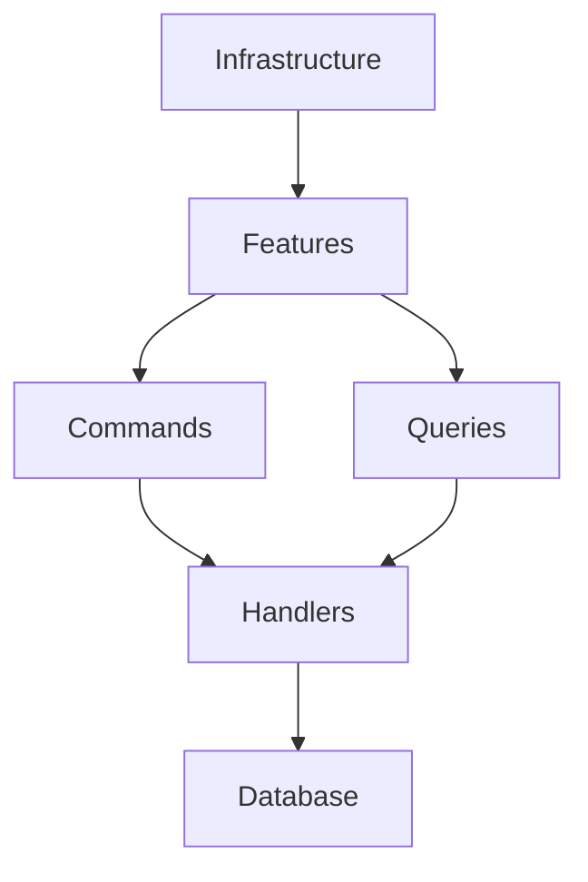

# HxH gRPC Microservices

>### .NET 9 Vertical Slice Architecture

### Packages
- ClassLibrary.HxH_Services
```
Microsoft.Extensions.Logging.Abstractions
Oracle.ManagedDataAccess.Core
```
- Grpc.HunterService
```
ClassLibrary.HxH_Services
Grpc.AspNetCore
```
- TestConsoleApp
```
Google.Protobuf
Grpc.Net.Client
Grpc.Tools
```
- TestProject.Tests
```
ClassLibrary.HxH_Services
Grpc.Net.Client
Grpc.HunterService
Microsoft.AspNetCore.Mvc.Testing
```

### Design Patterns
- **CQRS** : Command Query Responsibility Segregation
- **Commands** : Commands are used to change the state of the system.
- **Queries** : Queries are used to retrieve data from the system.
- **Handlers** : Handlers are used to process commands and queries.

### Vertical Slice Architecture


### Structure
```
/HxG_gRPC_.NETCore
│
├── ClassLibrary.HxH_Services/
│   ├── Features/
│   │   ├── Hunter_NenType/
│   │   │   └── ...
│   │   ├── Hunters/
│   │   │   ├── Create/
│   │   │   │   ├── CreateHunterCommand.cs
│   │   │   │   └── CreateHunterHandler.cs
│   │   │   ├── Delete/
│   │   │   │   ├── DeleteHunterCommand.cs
│   │   │   │   └── DeleteHunterHandler.cs
│   │   │   ├── GetAll/
│   │   │   │   ├── GetAllHuntersHandler.cs
│   │   │   │   └── GetAllHuntersQuery.cs
│   │   │   ├── GetById/
│   │   │   │   ├── GetHunterByIdHandler.cs
│   │   │   │   └── GetHunterByIdQuery.cs
│   │   │   ├── Update/
│   │   │   │   ├── UpdateHunterCommand.cs
│   │   │   │   └── UpdateHunterHandler.cs
│   │   │   ├── HunterDto.cs
│   │   │   ├── HunterMapper.cs
│   │   │   ├── HunterValidationId.cs
│   │   │   └── HunterValidationRules.cs
│   │   └── NenTypes/
│   │       └── ...
│   ├── Infrastructure
│   │   └── OracleDbContext.cs
│   └── Shared/
│       └── Common/
│           └── QueryResult.cs
│
├── Grpc.HunterService/
│   ├── Mappers/
│   │   └── GrpcHunterMapper.cs
│   ├── Protos/
│   │   └── hunter_proto.proto
│   ├── Services/
│   │   └── GrpcHunterService.cs
│   ├── appsettings.json
│   └── Program.cs
│
├── TestConsoleApp/
│   ├── Protos/
│   │   └── hunter_proto.proto
│   ├── Services/
│   │   └── GrpcClientHunterService.cs
│   └── Program.cs
│
└── TestProject.Tests/
    ├── IntegrationTests/
    │   ├── Hunters/
    │   │   ├── Grpc/
    │   │   │   └── GrpcHunterServiceTests.cs
    │   │   ├── CreateHunterHandlerTests.cs
    │   │   ├── DeleteHunterByIdHandlerTests.cs
    │   │   ├── GetAllHuntersHandlerTests.cs
    │   │   ├── GetHunterByIdHandlerTests.cs
    │   │   └── UpdateHunterHandlerTests.cs
    │   └── OracleDbContextIntegrationTests.cs
    └── UnitTests/
        └── notimplement.cs
```

